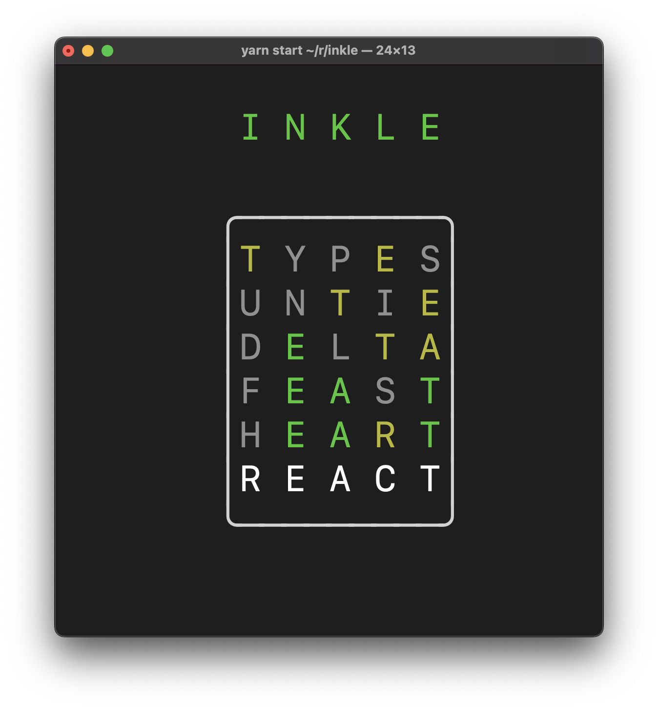

# inkle

Wordle in your Terminal, built with [Ink](https://github.com/vadimdemedes/ink). I blogged about it a little bit [here](https://spin.atomicobject.com/2022/04/21/terminal-wordle-react-ink/).

This is a work-in-progress. If you just want to play Wordle in your Terminal,
than you should probably go check out
[clidle](https://github.com/ajeetdsouza/clidle) instead.

## Running it

Using Node.js 14+:

- From NPM: `npx inkle`
- From git: clone the repo and `yarn build-start`
- Quit with esc or ctrl+C

## Future

- Fancier win/loss screens
- Hard mode

## Distant Future

- Daily vs. Practice mode. (deterministic, but not attempting to use Wordle's
  exact word for a given day)
- `--num-boards 3` to solve multiple boards at once, like
  [Dordle](https://zaratustra.itch.io/dordle) or
  [Quordle](https://www.quordle.com/#/)
- Option to copy emoji results to clipboard
